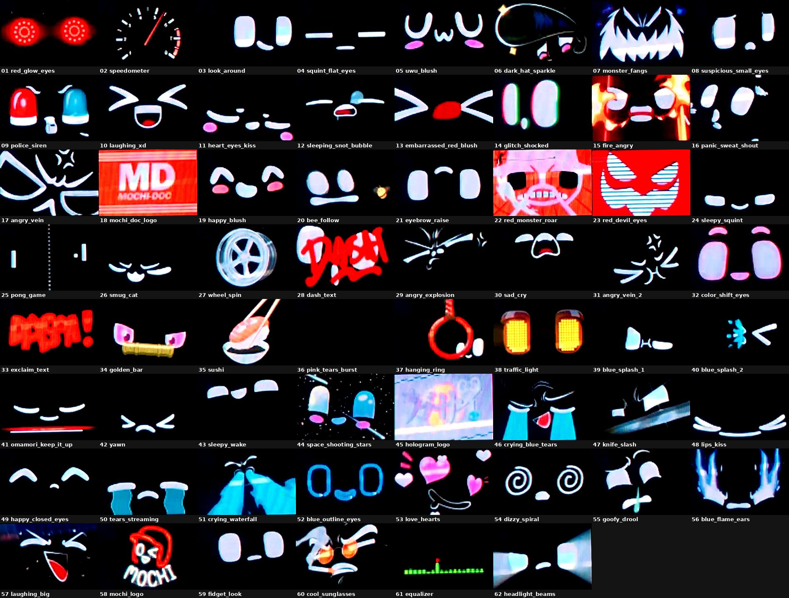

# Mochi3 – các đoạn animation

Video gốc `mochi3_screen_share.mp4` (4:41, 950x640, 30fps) được tách thành **62 clip**, mỗi clip là một animation biểu cảm riêng.

Cách tách: mỗi animation của Mochi đều bắt đầu và kết thúc ở mặt mặc định (2 mắt + miệng cười). Các khung hình có mặt mặc định được nhận diện tự động (so khớp template), dùng làm điểm cắt, sau đó kiểm tra lại bằng mắt. Có 3 điểm cắt thêm thủ công ở những chỗ hai animation nối thẳng vào nhau (1:10.0, 1:12.6, 2:14.1).



Tạo lại các clip:

```bash
python3 split_animations.py mochi3_screen_share.mp4 mochi3_animations/segments.json
```

| # | File | Bắt đầu | Kết thúc | Thời lượng | Nội dung |
|---|---|---|---|---|---|
| 1 | [01_red_glow_eyes.mp4](01_red_glow_eyes.mp4) | 0:00.0 | 0:09.2 | 9.2s | Chớp mắt → mắt đỏ phát sáng dạng vòng tròn |
| 2 | [02_speedometer.mp4](02_speedometer.mp4) | 0:09.2 | 0:18.8 | 9.6s | Đồng hồ tốc độ, kim quay lên vạch đỏ |
| 3 | [03_look_around.mp4](03_look_around.mp4) | 0:18.8 | 0:20.4 | 1.6s | Liếc nhìn sang hai bên |
| 4 | [04_squint_flat_eyes.mp4](04_squint_flat_eyes.mp4) | 0:20.4 | 0:22.7 | 2.3s | Mắt nheo dẹt (-_-) |
| 5 | [05_uwu_blush.mp4](05_uwu_blush.mp4) | 0:22.7 | 0:25.2 | 2.5s | Mặt UwU má hồng |
| 6 | [06_dark_hat_sparkle.mp4](06_dark_hat_sparkle.mp4) | 0:25.2 | 0:28.4 | 3.2s | Mũ/tóc đen lấp lánh che mặt, má hồng |
| 7 | [07_monster_fangs.mp4](07_monster_fangs.mp4) | 0:28.4 | 0:31.0 | 2.6s | Lửa xanh + mặt quái vật răng nanh |
| 8 | [08_suspicious_small_eyes.mp4](08_suspicious_small_eyes.mp4) | 0:31.0 | 0:32.6 | 1.6s | Mắt hẹp nghi ngờ, miệng chấm |
| 9 | [09_police_siren.mp4](09_police_siren.mp4) | 0:32.6 | 0:37.2 | 4.6s | Đèn còi cảnh sát đỏ - xanh |
| 10 | [10_laughing_xd.mp4](10_laughing_xd.mp4) | 0:37.2 | 0:39.0 | 1.8s | Cười lớn >_< (XD) |
| 11 | [11_heart_eyes_kiss.mp4](11_heart_eyes_kiss.mp4) | 0:39.0 | 0:41.7 | 2.7s | Mắt trái tim → hôn gió (3) |
| 12 | [12_sleeping_snot_bubble.mp4](12_sleeping_snot_bubble.mp4) | 0:41.7 | 0:49.5 | 7.8s | Ngủ gật, bong bóng mũi |
| 13 | [13_embarrassed_red_blush.mp4](13_embarrassed_red_blush.mp4) | 0:49.5 | 0:52.1 | 2.6s | Ngượng >_< đỏ mặt → cười ^_^ |
| 14 | [14_glitch_shocked.mp4](14_glitch_shocked.mp4) | 0:52.1 | 0:58.8 | 6.7s | Sốc, mắt nhiễu RGB glitch |
| 15 | [15_fire_angry.mp4](15_fire_angry.mp4) | 0:58.8 | 1:01.6 | 2.8s | Giận bốc lửa, nền đỏ |
| 16 | [16_panic_sweat_shout.mp4](16_panic_sweat_shout.mp4) | 1:01.6 | 1:06.3 | 4.7s | Hoảng hốt, đổ mồ hôi, hét |
| 17 | [17_angry_vein.mp4](17_angry_vein.mp4) | 1:06.3 | 1:10.0 | 3.7s | Tức giận, gân nổi (💢) |
| 18 | [18_mochi_doc_logo.mp4](18_mochi_doc_logo.mp4) | 1:10.0 | 1:12.6 | 2.6s | Logo MD MOCHI-DOC |
| 19 | [19_happy_blush.mp4](19_happy_blush.mp4) | 1:12.6 | 1:14.5 | 1.9s | Vui vẻ ^^ má hồng |
| 20 | [20_bee_follow.mp4](20_bee_follow.mp4) | 1:14.5 | 1:23.5 | 9.0s | Mắt dõi theo con ong bay |
| 21 | [21_eyebrow_raise.mp4](21_eyebrow_raise.mp4) | 1:23.5 | 1:27.2 | 3.7s | Nhướn mày |
| 22 | [22_red_monster_roar.mp4](22_red_monster_roar.mp4) | 1:27.2 | 1:35.4 | 8.2s | Mặt quái vật đỏ gầm |
| 23 | [23_red_devil_eyes.mp4](23_red_devil_eyes.mp4) | 1:35.4 | 1:39.4 | 4.0s | Mắt quỷ đỏ sọc ngang |
| 24 | [24_sleepy_squint.mp4](24_sleepy_squint.mp4) | 1:39.4 | 1:42.2 | 2.8s | Lim dim, nheo mắt |
| 25 | [25_pong_game.mp4](25_pong_game.mp4) | 1:42.2 | 1:50.5 | 8.3s | Trò chơi Pong bằng mắt |
| 26 | [26_smug_cat.mp4](26_smug_cat.mp4) | 1:50.5 | 1:55.9 | 5.4s | Mặt mèo tinh nghịch, nháy mắt |
| 27 | [27_wheel_spin.mp4](27_wheel_spin.mp4) | 1:55.9 | 2:00.8 | 4.9s | Mâm bánh xe quay |
| 28 | [28_dash_text.mp4](28_dash_text.mp4) | 2:00.8 | 2:07.3 | 6.5s | Chữ DASH đỏ + chuyển cảnh |
| 29 | [29_angry_explosion.mp4](29_angry_explosion.mp4) | 2:07.3 | 2:10.2 | 2.9s | Nổi giận bùng nổ |
| 30 | [30_sad_cry.mp4](30_sad_cry.mp4) | 2:10.2 | 2:12.8 | 2.6s | Buồn → mếu khóc |
| 31 | [31_angry_vein_2.mp4](31_angry_vein_2.mp4) | 2:12.8 | 2:14.1 | 1.3s | Tức giận, gân nổi (lần 2) |
| 32 | [32_color_shift_eyes.mp4](32_color_shift_eyes.mp4) | 2:14.1 | 2:18.9 | 4.8s | Mắt đổi màu liên tục |
| 33 | [33_exclaim_text.mp4](33_exclaim_text.mp4) | 2:18.9 | 2:23.0 | 4.1s | Chữ cảm thán đỏ “BABA!” |
| 34 | [34_golden_bar.mp4](34_golden_bar.mp4) | 2:23.0 | 2:27.7 | 4.7s | Thanh vàng + mắt hồng |
| 35 | [35_sushi.mp4](35_sushi.mp4) | 2:27.7 | 2:33.8 | 6.1s | Gắp sushi chấm xì dầu |
| 36 | [36_pink_tears_burst.mp4](36_pink_tears_burst.mp4) | 2:33.8 | 2:36.7 | 2.9s | Nước mắt hồng phun trào |
| 37 | [37_hanging_ring.mp4](37_hanging_ring.mp4) | 2:36.7 | 2:41.2 | 4.5s | Vòng đỏ treo (tay nắm) đung đưa |
| 38 | [38_traffic_light.mp4](38_traffic_light.mp4) | 2:41.2 | 2:46.4 | 5.2s | Đèn giao thông đỏ → vàng → xanh |
| 39 | [39_blue_splash_1.mp4](39_blue_splash_1.mp4) | 2:46.4 | 2:49.7 | 3.3s | Bị bắn nước xanh (1) |
| 40 | [40_blue_splash_2.mp4](40_blue_splash_2.mp4) | 2:49.7 | 2:53.2 | 3.5s | Bị bắn nước xanh (2) |
| 41 | [41_omamori_keep_it_up.mp4](41_omamori_keep_it_up.mp4) | 2:53.2 | 2:57.8 | 4.6s | Bùa 勝守 + “がんばれ KEEP IT UP!” |
| 42 | [42_yawn.mp4](42_yawn.mp4) | 2:57.8 | 3:02.8 | 5.0s | Ngáp |
| 43 | [43_sleepy_wake.mp4](43_sleepy_wake.mp4) | 3:02.8 | 3:05.8 | 3.0s | Buồn ngủ → tỉnh dậy |
| 44 | [44_space_shooting_stars.mp4](44_space_shooting_stars.mp4) | 3:05.8 | 3:10.9 | 5.1s | Không gian, sao băng, mắt màu |
| 45 | [45_hologram_logo.mp4](45_hologram_logo.mp4) | 3:10.9 | 3:15.5 | 4.6s | Màn hình logo hologram |
| 46 | [46_crying_blue_tears.mp4](46_crying_blue_tears.mp4) | 3:15.5 | 3:17.8 | 2.3s | Khóc nước mắt xanh, miệng đỏ |
| 47 | [47_knife_slash.mp4](47_knife_slash.mp4) | 3:17.8 | 3:21.5 | 3.7s | Lưỡi dao chém |
| 48 | [48_lips_kiss.mp4](48_lips_kiss.mp4) | 3:21.5 | 3:26.5 | 5.0s | Môi hôn |
| 49 | [49_happy_closed_eyes.mp4](49_happy_closed_eyes.mp4) | 3:26.5 | 3:29.4 | 2.9s | Cười híp mắt ^^ |
| 50 | [50_tears_streaming.mp4](50_tears_streaming.mp4) | 3:29.4 | 3:33.6 | 4.2s | Nước mắt chảy dòng |
| 51 | [51_crying_waterfall.mp4](51_crying_waterfall.mp4) | 3:33.6 | 3:35.8 | 2.2s | Khóc như thác |
| 52 | [52_blue_outline_eyes.mp4](52_blue_outline_eyes.mp4) | 3:35.8 | 3:40.7 | 4.9s | Mắt viền xanh dương |
| 53 | [53_love_hearts.mp4](53_love_hearts.mp4) | 3:40.7 | 3:44.1 | 3.4s | Say đắm, nhiều trái tim |
| 54 | [54_dizzy_spiral.mp4](54_dizzy_spiral.mp4) | 3:44.1 | 3:50.2 | 6.1s | Chóng mặt, mắt xoắn ốc |
| 55 | [55_goofy_drool.mp4](55_goofy_drool.mp4) | 3:50.2 | 3:55.2 | 5.0s | Mặt ngố, chảy dãi |
| 56 | [56_blue_flame_ears.mp4](56_blue_flame_ears.mp4) | 3:55.2 | 3:59.0 | 3.8s | Lửa xanh bốc lên |
| 57 | [57_laughing_big.mp4](57_laughing_big.mp4) | 3:59.0 | 4:01.4 | 2.4s | Cười to há miệng |
| 58 | [58_mochi_logo.mp4](58_mochi_logo.mp4) | 4:01.4 | 4:09.4 | 8.0s | Logo MOCHI |
| 59 | [59_fidget_look.mp4](59_fidget_look.mp4) | 4:09.4 | 4:16.2 | 6.8s | Cử động nhỏ >r< và nhìn quanh |
| 60 | [60_cool_sunglasses.mp4](60_cool_sunglasses.mp4) | 4:16.2 | 4:20.4 | 4.2s | Ngầu với kính râm cam |
| 61 | [61_equalizer.mp4](61_equalizer.mp4) | 4:20.4 | 4:26.1 | 5.7s | Cột sóng nhạc (equalizer) |
| 62 | [62_headlight_beams.mp4](62_headlight_beams.mp4) | 4:26.1 | 4:41.6 | 15.5s | Mắt phát tia đèn pha |
