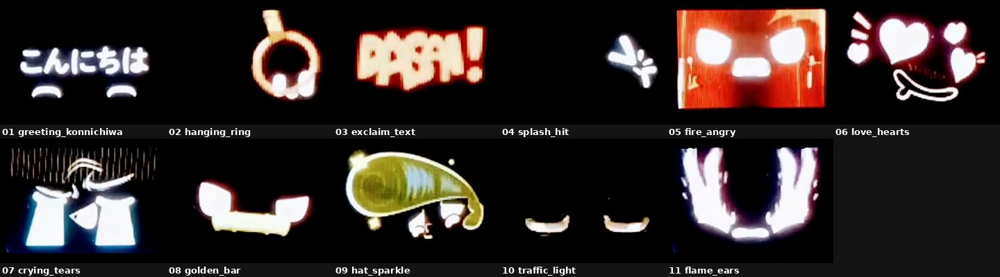

# Mochi screen – các đoạn animation

Video gốc `mochi_screen.mp4` (1:05, 960x720, 30fps) được tách thành **11 clip**, mỗi clip là một animation. Cách tách giống `mochi3_animations`: điểm cắt đặt tại khung mặt mặc định (2 mắt + miệng cười) ngay trước khi animation kế tiếp bắt đầu.



Tạo lại các clip:

```bash
python3 split_animations.py mochi_screen.mp4 mochi_screen_animations/segments.json
```

| # | File | Bắt đầu | Kết thúc | Thời lượng | Nội dung |
|---|---|---|---|---|---|
| 1 | [01_greeting_konnichiwa.mp4](01_greeting_konnichiwa.mp4) | 0:00.0 | 0:06.8 | 6.8s | Chữ もち → こんにちは (xin chào), chớp mắt |
| 2 | [02_hanging_ring.mp4](02_hanging_ring.mp4) | 0:06.8 | 0:14.0 | 7.2s | Vòng treo (tay nắm) đung đưa |
| 3 | [03_exclaim_text.mp4](03_exclaim_text.mp4) | 0:14.0 | 0:21.1 | 7.1s | Chữ cảm thán “BABA!” |
| 4 | [04_splash_hit.mp4](04_splash_hit.mp4) | 0:21.1 | 0:26.2 | 5.1s | Bị bắn nước, nheo mắt >_< |
| 5 | [05_fire_angry.mp4](05_fire_angry.mp4) | 0:26.2 | 0:30.2 | 4.0s | Giận bốc lửa, nền đỏ |
| 6 | [06_love_hearts.mp4](06_love_hearts.mp4) | 0:30.2 | 0:36.8 | 6.6s | Uống → say đắm, nhiều trái tim |
| 7 | [07_crying_tears.mp4](07_crying_tears.mp4) | 0:36.8 | 0:40.2 | 3.4s | Khóc chảy nước mắt |
| 8 | [08_golden_bar.mp4](08_golden_bar.mp4) | 0:40.2 | 0:46.8 | 6.6s | Thanh vàng ngang miệng |
| 9 | [09_hat_sparkle.mp4](09_hat_sparkle.mp4) | 0:46.8 | 0:52.1 | 5.3s | Mũ/tóc vàng lấp lánh, má hồng |
| 10 | [10_traffic_light.mp4](10_traffic_light.mp4) | 0:52.1 | 0:59.2 | 7.1s | Đèn giao thông đỏ → vàng → xanh |
| 11 | [11_flame_ears.mp4](11_flame_ears.mp4) | 0:59.2 | 1:05.6 | 6.4s | Lửa bốc lên hai bên |
